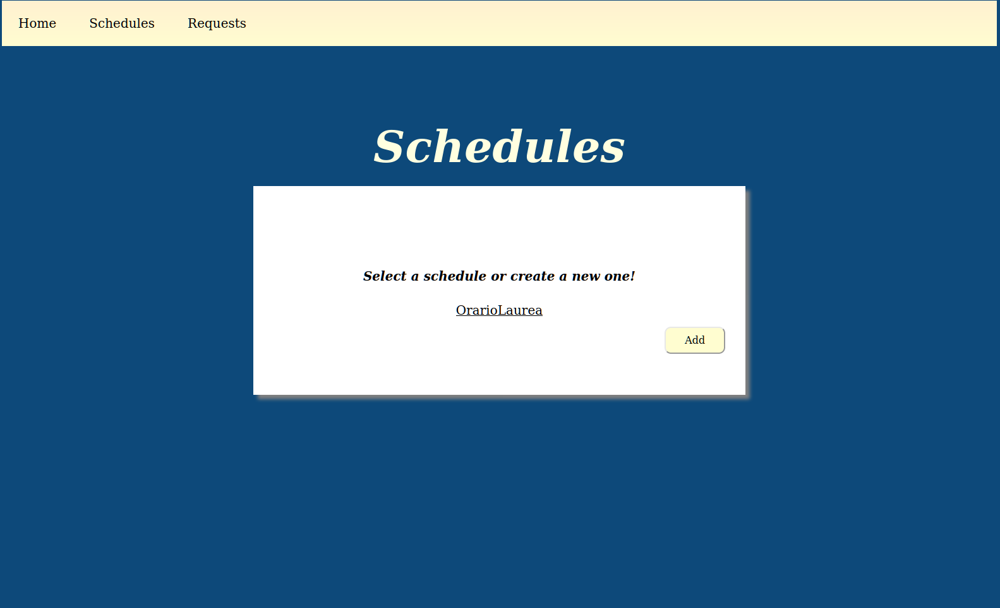
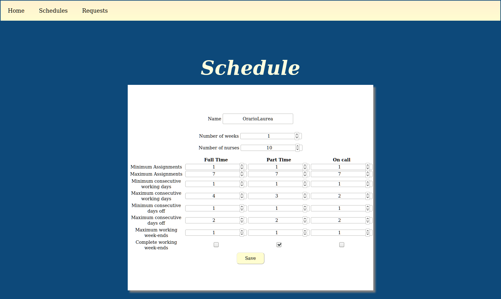
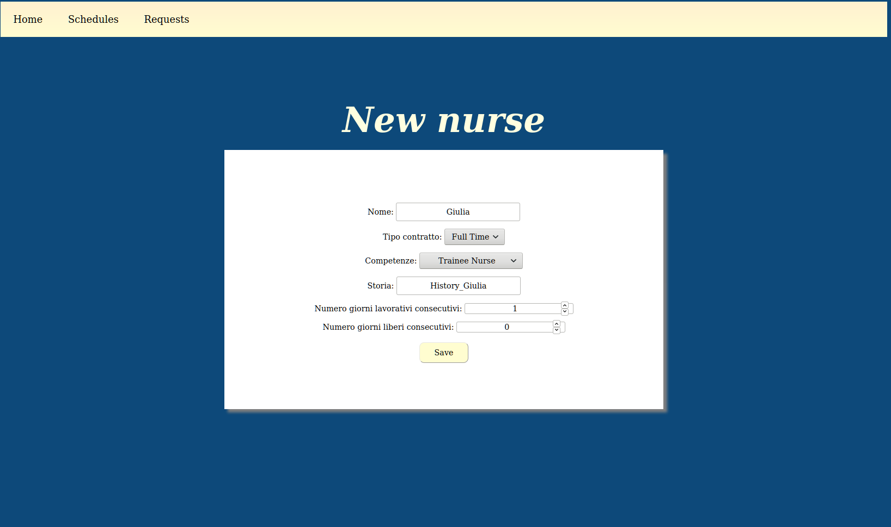
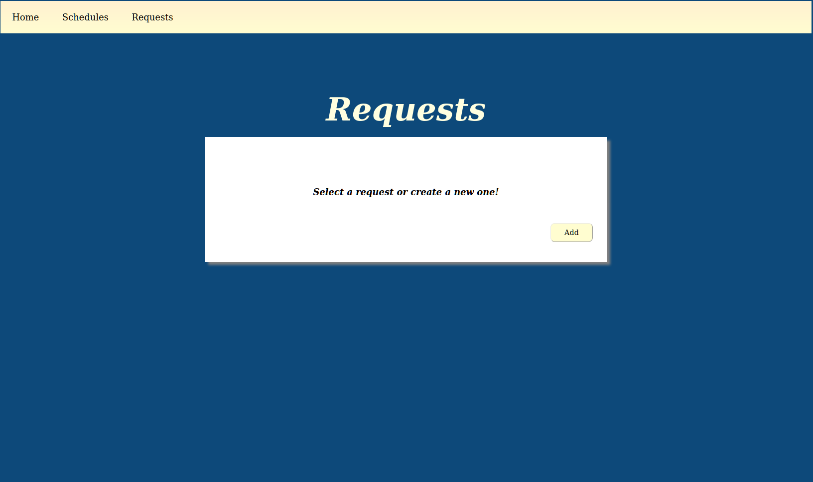
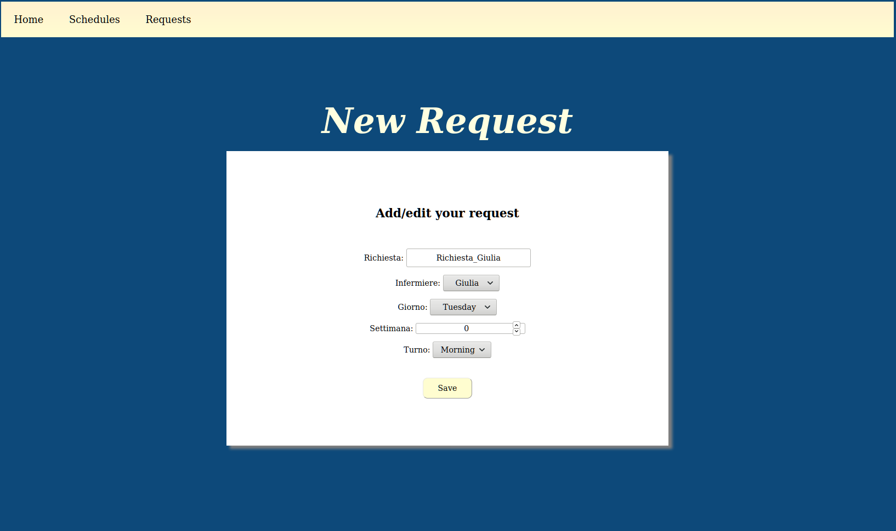
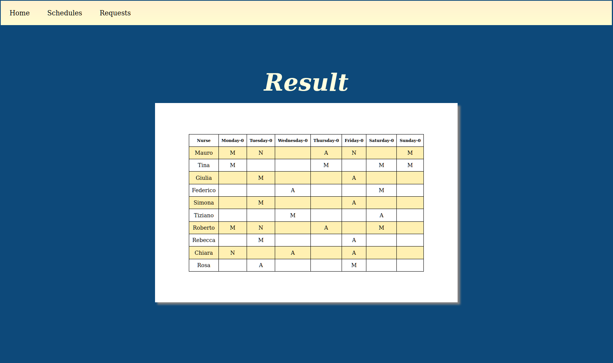
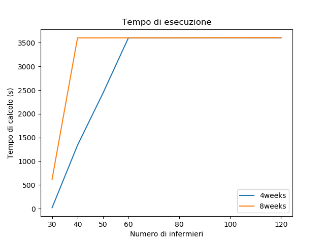
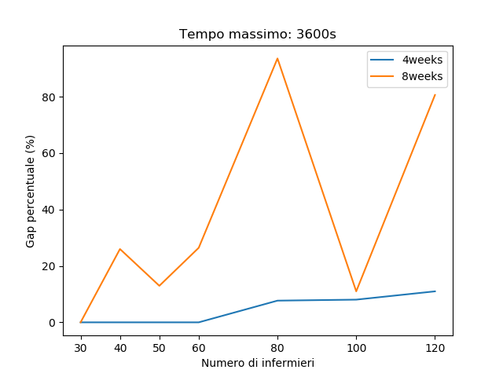

# Shift-Change-Management
*Bachelor Thesis*: optimization program to manage the changing of nurses shifts in a hospital

This thesis is based on an **International Competition** happend between 2014 and 2015, in which it was requested to design a system that would optimize the scheduling of shifts within a hospital.

So, given* N *nurses and  *M* weeks, the goal is to obtain the nurses's timetable within the selected period, in order to satisfy most of the constraints imposed on the optimization problem.

This type of problem was modeled as an Integer Linear Programming Problem, in which all integer variables and mostly binary ones were used.

It was also created a web application, which makes the program available to users.

Experiments have also been made to analyze the functionality of the model created which show that it is a very good model because it always finds a feasible solution.

## The Model

The model was written in Python, using as optimization software Gurobi.

Files:
- *Constants.py*: contains the constants of the program;
- *Preprocessing.py*: file that prepare some historical data for use;
- *Random_Data.py*: contains randomly generated data;
- *Model.py*: contains the implementation of the model, with all the binary variables and the hard and soft constraints;
- *Read_Data.py*: contains functions that transform the actual competition data format into a format created for the program;
- *Real_Exp.py*: experiments made to analyze the model created. The percentage gap and che calculation time of the solution were measured by setting a maximum time of 1 hour. 

## The Interface
It is not just an interface but it's a real web application, with a front end part and a back end part. It was created using the framework Django.

Main files: 
- *models.py*;
- *views.py*;
- *serializers.py*;
- *urls.py*;
- *forms.py*.

## Experiments
Changing the number of nurses and the period from 4 to 8 weeks, were misureted the percentage gap and the calculation time of the solution imposing 1h as the maximum time.

## Download
1. BeautifulTable for Python:
https://pypi.org/project/beautifultable/
1. Names generator for Python:
https://pypi.org/project/names/
1. Gurobi: 
https://www.gurobi.com/
1. Django:
https://www.djangoproject.com/

